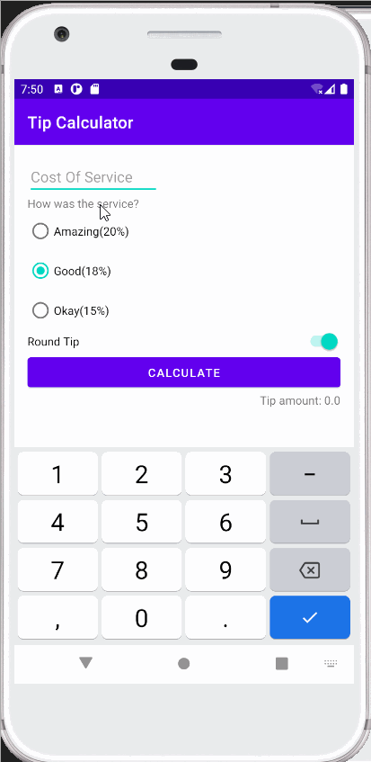

WeightConverter - Code
=====================

Introduction
------------

TipCalculator is an interactive mobile application which calculates the tip amount based on the 
cost of service and the satisfaction rate.

Getting Started
---------------

1. Download or clone the app.
2. Open the app using android studio.
3. Run the app